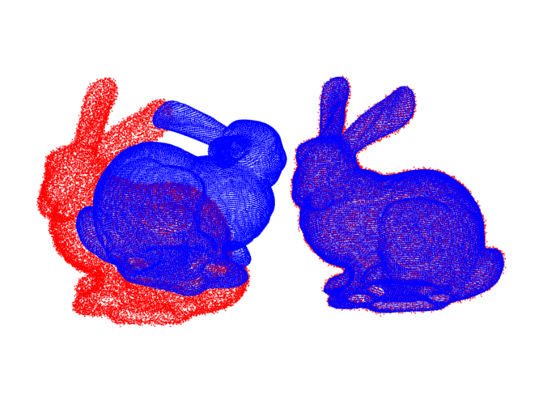
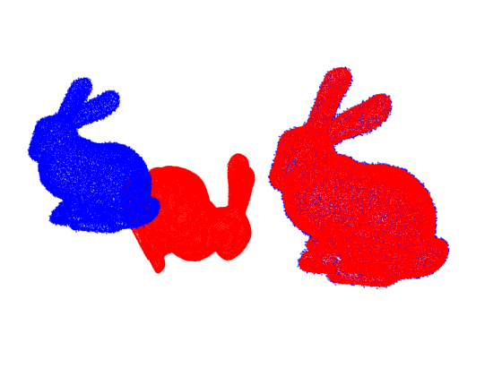
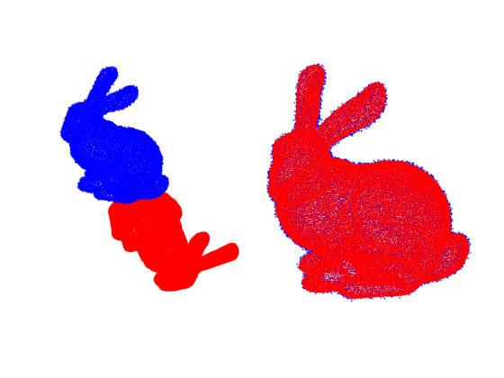
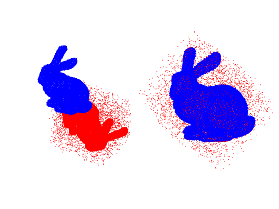
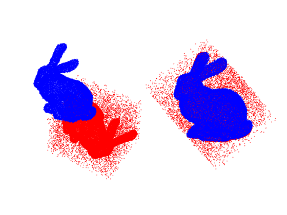
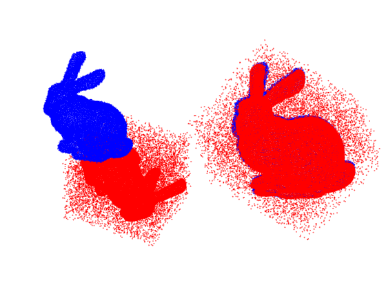

# CPCA

# 3D-Pointcloud-registration-in arbitrary position
Matching two point-clouds in arbitrary position within a short time;

Based on libnabo.

# lib necessary-

1- Eigen 3.0+ from http://eigen.tuxfamily.org

2- boost form http://www.boost.org

3- libnabo from http://github.com/ethz-asl/libnabo

# Usage

Ignore the parameters include "weld" feature, it is for another thing,

Using the VS2012+ to compile this project .

# Exsample
Using the the pointCloud of Stanford Rabbit，the matched result show as follow 

